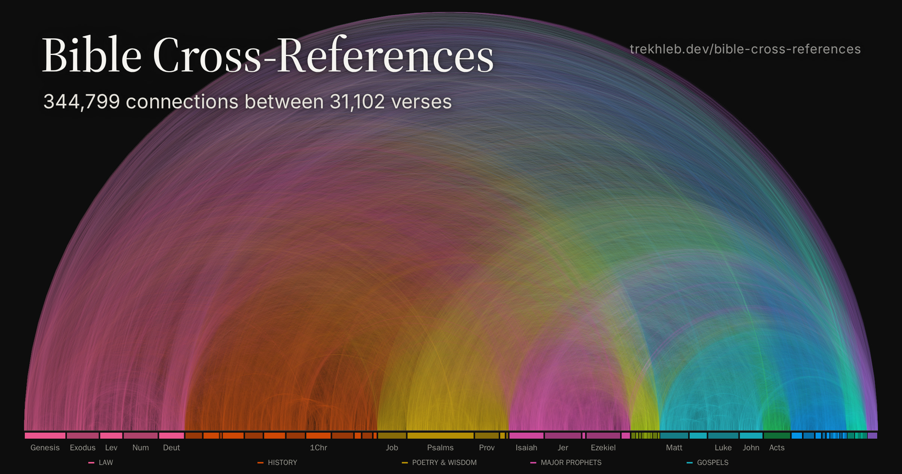
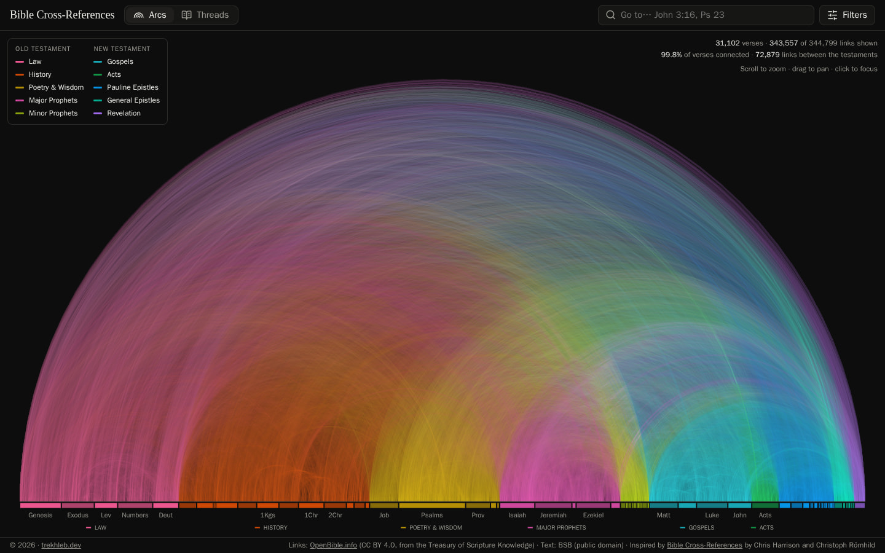
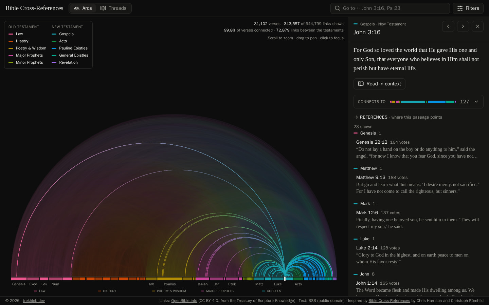
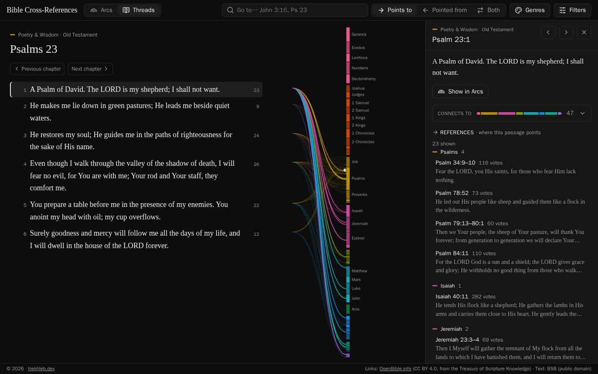
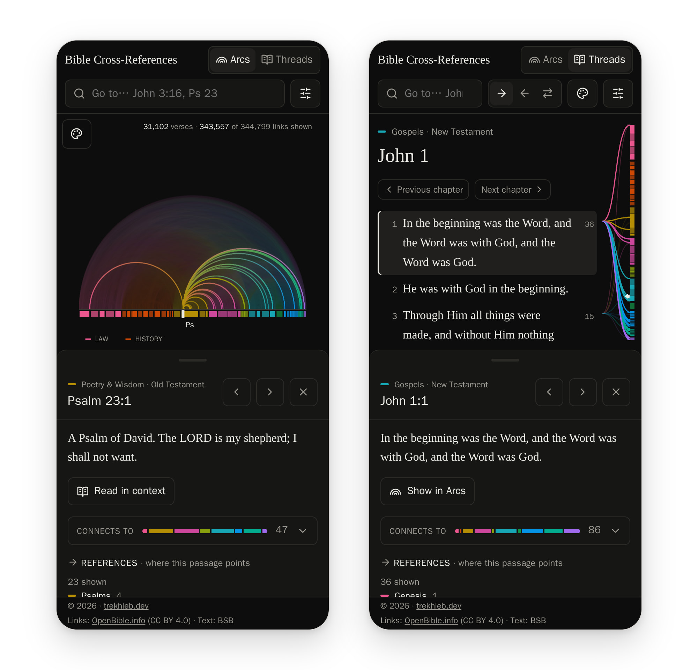

# Bible Cross-References

[](https://trekhleb.dev/bible-cross-references/)

See how the Bible is woven together, and read any passage with its connections in view.

**▶ [Open Bible Cross-References](https://trekhleb.dev/bible-cross-references/)**

## Why this exists

For centuries, readers of the Bible have followed cross-references: the small notes in the margin
that send you from one passage to another that echoes, quotes or fulfills it. The _Treasury of
Scripture Knowledge_ alone lists hundreds of thousands of them. On paper you can only follow them
one at a time, so the bigger picture stays hidden: how the prophets echo the Law, how the New
Testament quotes the Psalms and Isaiah, how far a single verse reaches.

This project draws all 344,799 of them at once. You can start from a bird's-eye view of the whole
Bible, zoom down to a single verse, and read it in context with every connection one click away.
It aims to be two things: a picture of how deeply the Bible is interconnected, and a practical
companion while reading.

It is free, open source, and built only on openly licensed data (see [Data](#data)).

## What you can do

### Arcs: the whole Bible at once



- All 31,102 verses sit on one line, from Genesis to Revelation, and every cross-reference is an
  arc colored by the genres it connects.
- Zoom from the whole Bible down to single verses; hover a passage to see how many connections it
  has.
- Search for any reference ("John 3:16", "Ps 23") or click a passage to see where its links land.

### Focus a passage



The details panel shows the passage's text, where its connections go by genre, and every reference
with its text. Each one is a link: follow it to travel there. "Read in context" opens the passage in
Threads.

### Threads: read with the connections in view



- Read a chapter while each verse sends threads to where its cross-references land in the whole
  Bible, shown as a bar of all 66 books.
- Switch between what a verse points to, what points to it, or both.
- Tap a verse for its connections and follow them from passage to passage. "Show in Arcs" leads
  back to the big picture.

### On your phone



Both views work on phones, with the details in a bottom sheet. After the first visit the site loads
instantly and works offline, and it can be installed as an app. Every passage has its own link,
filters included, e.g.
[`?ref=John.3.16`](https://trekhleb.dev/bible-cross-references/?ref=John.3.16), so you can share
exactly what you are looking at.

## Data

The app is built on two openly licensed datasets:

| Dataset          | Source                                                                                                                                | License                                                   |
| ---------------- | ------------------------------------------------------------------------------------------------------------------------------------- | --------------------------------------------------------- |
| Bible text       | [Berean Standard Bible](https://berean.bible/) (BSB)                                                                                  | [Public domain](https://berean.bible/terms.htm)           |
| Cross-references | [OpenBible.info](https://www.openbible.info/labs/cross-references/), largely from the public-domain _Treasury of Scripture Knowledge_ | [CC BY 4.0](https://creativecommons.org/licenses/by/4.0/) |

A note on what the links mean: they are the _Treasury of Scripture Knowledge_'s cross-references,
which connect passages by shared themes, words, people and events. OpenBible.info readers have
voted on how helpful each link is; the votes rank the links, they don't prove them right or wrong.
By default the site hides only the links that readers voted down (0.4%); the Filters menu can raise
the minimum number of votes.

Both files are committed to [`data/raw/`](data/raw/) exactly as downloaded, and
[`data/sources.json`](data/sources.json) pins each one by SHA-256, so the site can always be
rebuilt, even if an upstream URL changes. `npm run dev` and `npm run build` turn them into the app's
datasets in `public/data/` (generated, git-ignored), validated against the canonical KJV
versification (31,102 verses).

To adopt a newer upstream version (OpenBible.info updates its vote counts from time to time):

```sh
npm run data:fetch -- --update   # download and re-pin the new version
npm run data:build               # rebuild, then review the numbers on /debug/
```

Then commit `data/raw/` and `data/sources.json`.

## Development

Requirements: [Node.js](https://nodejs.org/) 24 or newer (see `.nvmrc`).

```sh
npm install
npm run dev
```

Then open <http://localhost:5173/> for the app, or <http://localhost:5173/debug/> for an internal
page that shows the datasets behind it.

| Script               | Purpose                                                         |
| -------------------- | --------------------------------------------------------------- |
| `npm run dev`        | Build the datasets and start the Vite dev server                |
| `npm run build`      | Build the datasets, type-check, and build the site into `dist/` |
| `npm run preview`    | Serve the built site locally, at its deployed path (see below)  |
| `npm run data`       | Verify the raw files, or fetch missing ones, and build datasets |
| `npm run check`      | Everything CI runs: type check, lint, format check, unit tests  |
| `npm run test:watch` | Run the unit tests in watch mode                                |
| `npm run format`     | Format all files with Prettier                                  |

### Project structure

```text
data/                    Upstream data (raw/, committed) and its pins (sources.json)
scripts/data/            Data pipeline: fetch and build CLIs, one importer per source
index.html, threads/     Page entries of the app (the same app, one per view)
debug/                   Page entry of the internal data page
vite/                    Build plugins: page metadata, first frame, offline cache, analytics
sw/                      The service worker that caches the site for offline use
public/                  Icons, the social preview image and README screenshots
src/core/                Framework-free domain code shared by the app and the pipeline
  bible/                 Books, genres, versification, verse references, passages
  datasets/              Dataset IDs, file formats and their runtime validation
src/translations/        Translation plugins: manifests, registry, loading, text search
src/cross-references/    Cross-reference plugins: manifests, registry, bidirectional index
src/app/                 The app: its views, the URL state and the view switch
src/visualizations/      One folder per visualization (Arcs, Threads), plus shared blocks
src/features/debug/      The /debug/ page
src/shared/              Reusable UI (footer, icons, tables), styles, formatting and loading
tests/                   Repository-level tests (e.g. visualizations never import each other)
```

Visualizations never import each other; `src/app/views.ts` lists them, and the app connects them.

### Deployment

The site is static. It is published with GitHub Pages at
[trekhleb.dev/bible-cross-references](https://trekhleb.dev/bible-cross-references/), so production
builds use the base path `/bible-cross-references/`, and `npm run preview` serves the build at
<http://localhost:4173/bible-cross-references/>. Besides the pages, the build writes:

- the page metadata: canonical URLs, Open Graph and Twitter cards, and structured data;
- `sitemap.xml`;
- a web app manifest and a service worker (from [`sw/`](sw/)). The worker is scoped to the site's
  path, so it never touches the rest of the domain.

The live site counts visits with Google Analytics. The tag only reports from trekhleb.dev, so local
previews and forks deployed elsewhere send nothing. To build for another location, set the path and
the origin:

```sh
BASE_PATH=/ SITE_ORIGIN=https://example.org npm run build
```

## License

The code is released under the [MIT License](LICENSE). The data keeps its own licenses (see
[Data](#data)):

> Cross-reference data: OpenBible.info (CC BY 4.0), largely from the public-domain Treasury of
> Scripture Knowledge. Modified: re-indexed to KJV verse numbering.
> Scripture text: Berean Standard Bible (BSB), dedicated to the public domain.

UI icons are from [Lucide](https://lucide.dev/) (ISC License), plus one pinch icon from
[Material Design Icons](https://fonts.google.com/icons) (Apache License 2.0), via
[react-icons](https://react-icons.github.io/react-icons/) (MIT). The views are original designs:
Arcs is inspired by Chris Harrison and Christoph Römhild's
[Bible Cross-References](https://www.chrisharrison.net/index.php/Visualizations/BibleViz), and the
genre colors by Drawing with Data's [Bible Fascinator](https://designs.drawingwithdata.com/fascinator).
